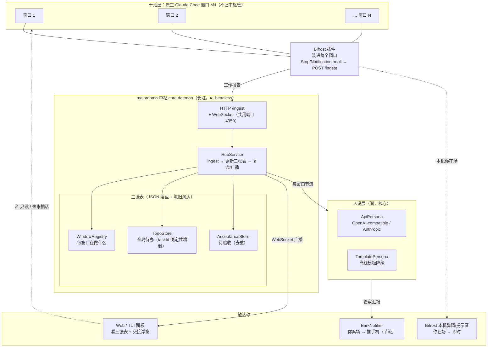
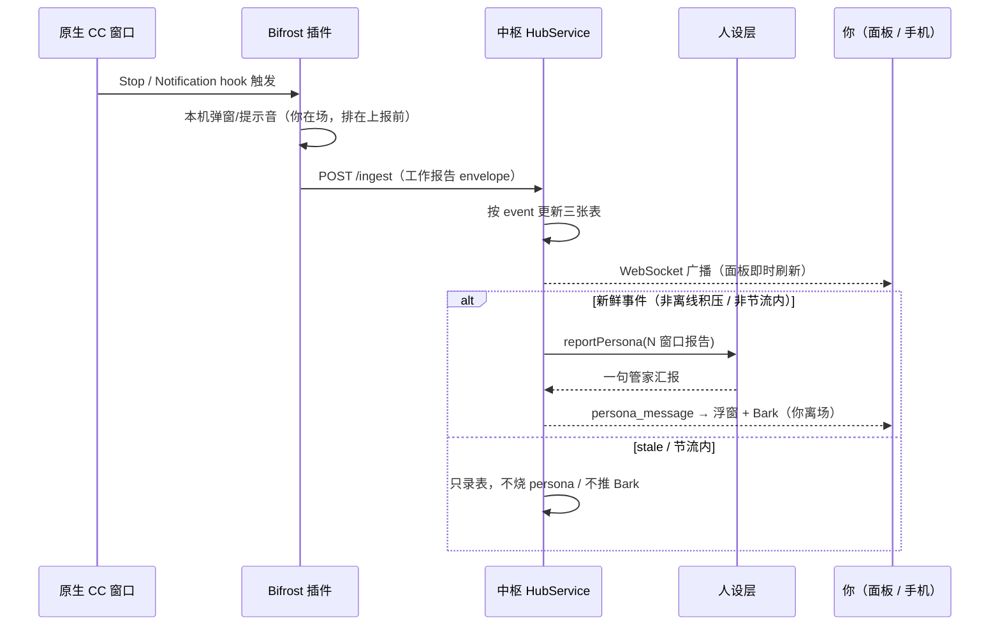

# majordomo 架构

> 代号「指挥官」。一个旁观 N 个原生 Claude Code 窗口的人设管家中枢。
> 设计脉络见 `docs/design/main-mind.md` → `pivot-to-hub.md`；中枢 v1 施工见 `bifrost-hub-v1.md`。本文是落地后的架构说明。

## 核心思路

majordomo **不驱动工作层**。真正干活的是你手边一群**原生 Claude Code 窗口**（本地或服务器）——
它们的交互体验持续跟着官方迭代，自建工作层追不上。majordomo 只做插件天花板做不到的两件事：

1. **跨窗口的 persona 复命**：同时读 N 个窗口的报告，合成**一句管家汇报**（「少爷，3 号重构好了；5 号卡在权限等您点头」）。单窗口 hook 没有跨窗口视野。
2. **常驻中枢 + 全局待办 + 多前端查岗**：一个长驻进程维护跨窗口状态，让你从终端 / 网页 / 手机连同一份状态。

每个窗口装 **Bifrost 插件**，用 hook 把工作报告 `POST` 给中枢（单向、零中枢依赖）。中枢维护三张表，
persona 复命，通过面板广播 + Bark 触达你。core 从第一天就是长驻 daemon，前端都是它的客户端——
这让「headless 跑服务器 / 推手机 / 网页查岗」成为自然延伸。

## 模块图

## 一次上报的数据流

## 三张表

| 表 | 文件 | 更新方式 | 淘汰 |
|---|---|---|---|
| **WindowRegistry** 每窗口在做什么 | `hub-windows.json` | state 由事件推导 | offline 超 7 天清 |
| **TodoStore** 全局待办 | `hub-todos.json` | `task_created/completed` 走 taskId **确定性**增删，不烧 LLM | done 超 7 天清 |
| **AcceptanceStore** 待验收 | `hub-acceptance.json` | `notification` 触发，按窗口去重（`idle_prompt` 不入表） | resolved 超 7 天清 |

数据**单向**：窗口 → Bifrost → 中枢 → 你。v1 面板只读（展示 + 勾/删待办、标记验收），不向窗口回话。

## 关键设计取舍

- **中枢不碰终端**：daemon 是纯 headless Node 进程，吐 HTML + WebSocket 数据；图形界面由**你的浏览器**渲染。服务器只需终端，别装桌面。
- **Bifrost 零中枢依赖**：插件只认一个能 POST 的 URL，不 import 中枢任何代码。这让 `git subtree split` 拆独立仓零成本。
- **上报靠 command 脚本，不纯 http**：`Stop` 事件实测直带 `last_assistant_message`（探针推翻了「必须读 transcript」），但仍走 `report.ps1` 以便本机弹窗 + 编码修正 + 离线缓存。
- **本机弹窗排在上报之前**：同步 POST 会把弹窗推后 `timeoutSec` 秒。顺序：先本机信号，再上报。
- **通知职责划分**（pivot 后）：本机你在场 → Bifrost 弹窗/提示音（即时、不节流）；你离场 → 中枢 Bark（节流）。默认 `notifiers` **不含 powershell**——同机会与 Bifrost 叠弹（声音有 `beep.lock` 互斥，视觉弹窗无跨进程互斥）。
- **persona 是大脑，hook 是管道**：hook 只运输原始技术输出；合成「一句管家汇报」只有中枢里同时看 N 窗口的 persona 能做。这是 majordomo 存在的唯一理由。
- **stale 只录表**：离线窗口重连后排空的积压事件（`ts` 超 5min）只更新表，不触发 persona / Bark，避免历史事件炸你手机。
- **端口 4350**：HTTP `/ingest` 与 WebSocket 共用一个端口，避开 WXWork 霸占的 4317。Bifrost `ingestUrl` 必须一致。
- **存储用 JSON 文件**（`~/.majordomo/`，可用 `MAJORDOMO_HOME` 覆盖）：避开 Windows native 模块编译，未来可换 SQLite。
- **profile 切换只影响新开会话**：坑——内网版个人目录是 `.claude-internal` 而非 `.claude`。

## 可选旧路径：自建工作层调度器（已退役，非主路径）

转型前 majordomo 是「有人设前端的 Claude Code 调度器」：`SdkWorker` 持有常驻会话干活，
`canUseTool` 回调把权限请求转给前端 UI。这套仍完整编译、TUI 仍可用它驱动单个会话，
但**已非主路径**——原生窗口的交互干不过它自己（转型理由见 `pivot-to-hub.md`）。

- **Worker 层**（`src/worker/`）：`SdkWorker`（`@anthropic-ai/claude-agent-sdk`，streaming input 常驻会话）/ `MockWorker`（回显，无凭证验收链路）。`auto` → 有 SDK 用 SDK，否则 mock；无 CLI fallback。
- **Session 生命周期**（`src/core/session.ts`）：`user_input → worker.send → 流式 text → done → persona.report → notify`。`SessionManager` 管会话池，`Store` 持久化。
- 保留它的价值：无需真实多窗口即可验收 core → persona → notifier 主链路。若打算彻底删除而非「保留为可选」，是另一个决策。

## 已知未做（留待后续）

- **面板反向能力**：v1 只读，未来支持从网页/手机插话或查岗任一窗口。
- **服务器场景**：中枢跑无桌面服务器、窗口在别处时，`stale` 判定应改用「中枢**收到**的时刻」而非窗口打的 `ts`（跨机时钟偏移会误判）。`report.ps1` 的 `ts` 只用于展示。
- **服务器窗口直达**：托管 pty + 网页终端（类 ttyd 但带管家大脑），重路径，待拍板。
- **立绘 / CG 渲染**（Web 面板已留位）。
