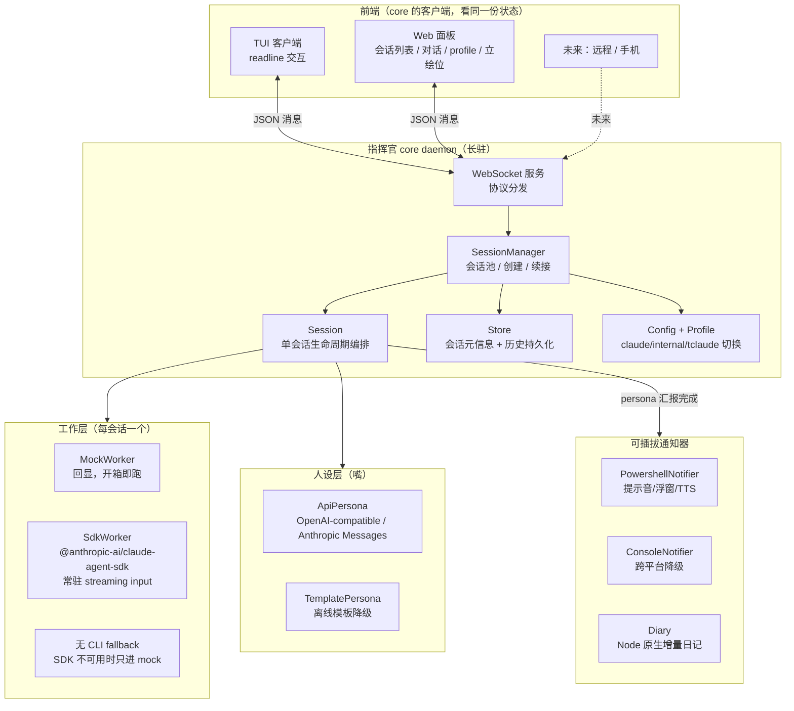
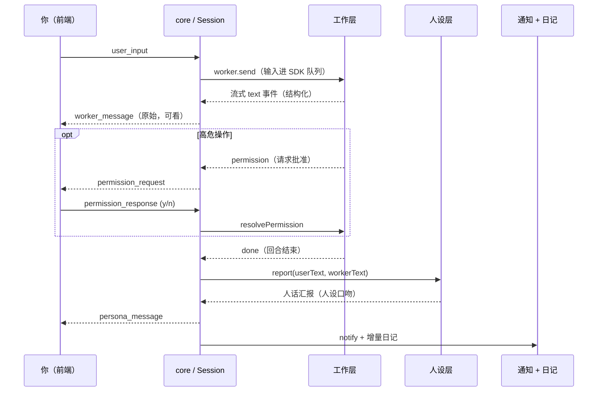

# majordomo 架构

> 代号「指挥官」。一个有人设前端的 Claude Code 多会话调度器。
> 设计来源见 `docs/design/main-mind.md`，本文是落地后的架构说明。

## 核心思路

不包真实 TUI、不做屏幕抓取。工作层（Claude Code）全程无头，吐结构化数据；
指挥官站在你和工作层之间，是一个有状态的中间人，自己拥有前端（TUI / Web）。

三层分工：

- **人设层（嘴）**：便宜模型 / 离线模板。读工作层输出，用人话向你汇报，负责日记 / 通知。无 agent 能力。
- **工作层（手）**：Claude Code，连续 session，干活。
- **文档层**：按需另开独立 session（后续迭代，写图形化验收文档）。

core 与前端从第一天就分离：core 是长驻 daemon，TUI / Web / 未来远程都是它的客户端，
通过 WebSocket 连同一份状态。这让「远程接入 / 推手机 / 公告板」成为自然延伸，而非重写。

## 模块图

## 一轮对话的数据流

## 关键设计取舍

- **Claude Code 接入以 Agent SDK 为准**：正式包是 `@anthropic-ai/claude-agent-sdk`。主路径使用 `query({ prompt: AsyncIterable<SDKUserMessage> })` 的 streaming input 模式；这既能常驻多轮，也能把 `/compact` 这类 slash command 当普通输入送入同一 session。
- **SDK 是唯一真实工作层**：SDK 已经提供 `canUseTool` 权限回调、`auto` 权限模式、compact boundary、session resume 等能力；不再保留 CLI fallback，避免用无状态一次性回合掩盖主工作流问题。
- **这不是为了支持 codex**：当前产品边界仍是 Claude Code 调度器。`WorkerEngine` 抽象只是在工程上隔离真实工作层与 mock 演示层，未来如果要接其他 agent 后端可以扩展，但不是这次 SDK 可选化的设计动机。
- **工作层两段降级**：`auto` 优先 SDK；没有 SDK 就 mock。mock 只用于无凭证环境验收 core / TUI / Web / persona / notifier 主链路，不承担真实任务。
- **工作层会话模型 = 常驻优先**（核心决策）：SDK Worker 用 streaming input 模式的 `query()`，传入一个受控 `AsyncIterable` 队列，进程全程不退、上下文在内存。这才是灵感文档说的"真连续"。`session_id` 仍持久化，`resume` 只作为**崩溃恢复兜底**，不是日常每轮手段。
- **`/compact` `/model` 透传在常驻 SDK 下天然生效**：作为普通用户消息喂进活着的 session 即可（SDK 官方支持 slash command 作为输入）；compact 返回 `SDKCompactBoundaryMessage`，Session 据此告知人设层。Auto-Compact 默认开启，多数时候无需手动。
- **自测与诊断**：`doctor` 检查 Node / SDK / profile 命令 / Web 资源 / 通知脚本；`selftest` 用临时 `MAJORDOMO_HOME` 隔离端到端验证。
- **权限走 SDK 原生 `auto` + `canUseTool`**：默认 `permissionMode: "auto"`，沿用主人日常使用习惯，由 Claude Code 的模型分类器先判断；需要人工介入时，`canUseTool` 回调触发 → Session 转 `permission_request` 给前端 → 用户应答 → resolve `{behavior:'allow'|'deny'}`。`acceptEdits` 作为可选模式保留，但不是默认。**不需要 MCP permission-prompt-tool 重桥接**。
- **profile 切换只影响新开会话**：已跑的会话绑死启动时的 profile；`activeProfile` 是用户级偏好，profile 命令写全局配置并覆盖项目示例值。坑：内网版个人目录是 `.claude-internal` 而非 `.claude`。
- **通知可插拔、日记走 Node 原生**：日记是人设层副作用，跨平台（Linux 服务器也能写），不绑死 PowerShell。
- **存储先用 JSON 文件**（`~/.majordomo/`，可用 `MAJORDOMO_HOME` 覆盖）：避开 Windows native 模块编译，协议层不依赖实现，未来可换 SQLite。

## 已知未做（留待后续）

- 文档层（另开 session 写验收文档）。
- 立绘 / CG 渲染（Web 面板已留位）。
- 远程接入（CF Access / 推手机 notifier）——通信层已是 WebSocket，留好口子。
