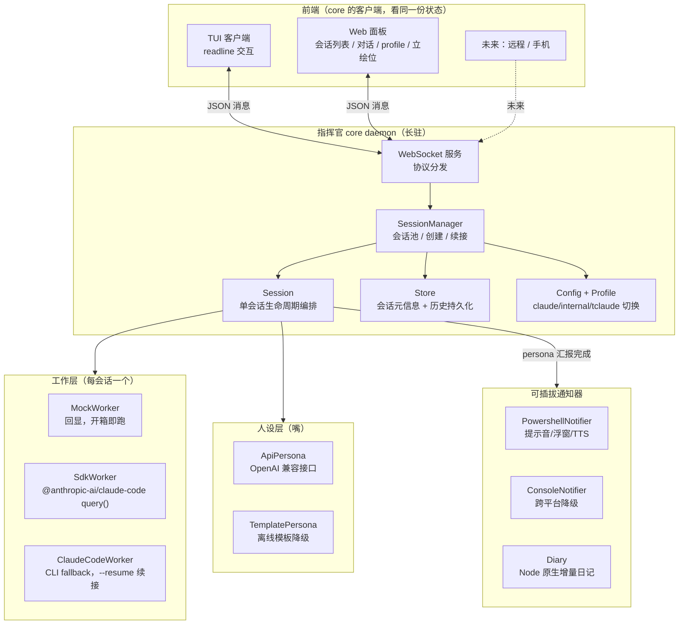
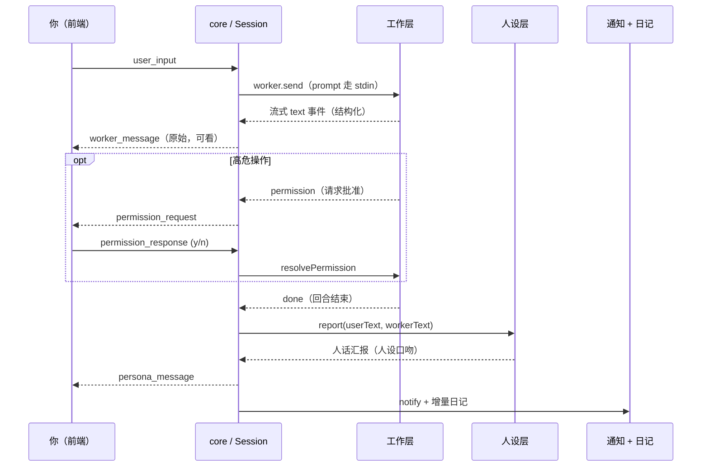

# majordomo 架构

> 代号「指挥官」。一个有人设前端的 Claude Code 多会话调度器。
> 设计来源见 `docs/design/main-mind.md`，本文是落地后的架构说明。

## 核心思路

不包真实 TUI、不做屏幕抓取。工作层（Claude Code）全程无头，吐结构化数据；
指挥官站在你和工作层之间，是一个有状态的中间人，自己拥有前端（TUI / Web）。

三层分工：

- **人设层（嘴）**：便宜模型 / 离线模板。读工作层输出，用人话向你汇报，负责日记 / 通知。无 agent 能力。
- **工作层（手）**：Claude Code，连续 session，干活。
- **文档层**：按需另开独立 session（后续迭代，写图形化验收文档）。

core 与前端从第一天就分离：core 是长驻 daemon，TUI / Web / 未来远程都是它的客户端，
通过 WebSocket 连同一份状态。这让「远程接入 / 推手机 / 公告板」成为自然延伸，而非重写。

## 模块图

## 一轮对话的数据流

## 关键设计取舍

- **Claude Code 接入以公开文档为准**：网络调研确认 TS SDK 包是 `@anthropic-ai/claude-code`，主 API 是 `query()` async iterator；公开文档没有稳定 `ClaudeSDKClient/canUseTool`。
- **工作层三段降级**：`auto` 优先 SDK；没有 SDK 就走 profile CLI；没有 CLI 就 mock，保证开箱即跑。
- **连续 session**：CLI fallback 用捕获 `session_id` + `--resume` 续接（可靠），不依赖 `--continue`。SDK Worker 也保存 streamed `session_id`。
- **安全启动**：CLI prompt 走 stdin，不把用户文本拼进命令行；Windows 下显式用 `cmd.exe /d /s /c`，避免 Node shell+args 弃用警告。
- **自测与诊断**：`doctor` 检查 Node / SDK / profile 命令 / Web 资源 / 通知脚本；`selftest` 用临时 `MAJORDOMO_HOME` 隔离端到端验证。
- **profile 切换只影响新开会话**：已跑的会话绑死启动时的 profile。坑：内网版个人目录是 `.claude-internal` 而非 `.claude`。
- **通知可插拔、日记走 Node 原生**：日记是人设层副作用，跨平台（Linux 服务器也能写），不绑死 PowerShell。
- **存储先用 JSON 文件**（`~/.majordomo/`，可用 `MAJORDOMO_HOME` 覆盖）：避开 Windows native 模块编译，协议层不依赖实现，未来可换 SQLite。

## 已知未做（留待后续）

- 工作层真正的交互式权限确认不应假设 `canUseTool`，公开文档给出的路线是 `--permission-prompt-tool` + MCP 工具桥接 UI。MockWorker 已演示完整权限 UI 流程，后续要补 MCP bridge。
- 文档层（另开 session 写验收文档）。
- 立绘 / CG 渲染（Web 面板已留位）。
- 远程接入（CF Access / 推手机 notifier）——通信层已是 WebSocket，留好口子。
