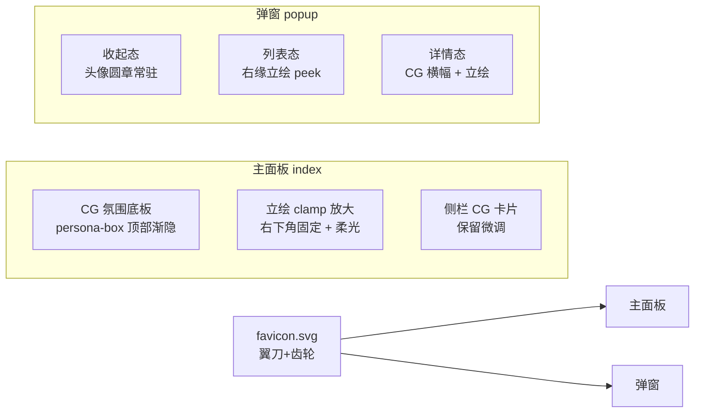

# 界面美术强化 · art pass v1

> 目标：把 `苏雨晴` 的立绘 / CG 真正用进界面，让"黑石海滩"配色有主角。不改数据流，只动 `src/web/public/` 前端。

## 立意

现有美术资源本身就是主题的化身——紫发猫耳女仆 + 彩虹机械翼 + 蜂蜜齿轮，站在黑石海滩上。CG 的深色海滩背景天然融进深色 UI，立绘浅背景则适合抠像做"角色在场"。所以：

- **CG** → 氛围底板（模糊、压暗、渐隐），铺在人设消息区顶部，让中枢"有场景"。
- **立绘** → 角色在场。主面板右下角固定、放大；弹窗里列表/详情/收起三态都能瞥见她。
- **图标** → 手工 SVG：彩虹翼刀 + 蜂蜜齿轮，取自立绘元素，替换旧的 `⌘`。

## 落点

## 手法要点（非参数表，凭感觉）

- CG 底板要**几乎看不见**——重压暗 + 向下渐隐到纯背景色，文字永远清楚。宁可淡。
- 立绘放大但**不喧宾夺主**：右下角、半透明微微、hover 时轻轻浮起亮起。指针穿透，不挡点击。
- 收起态头像用立绘的**头部裁切**（`object-position: top`），不需要新素材。
- 一切"无匹配文件自动隐藏"的老约定不变。

## 可以追加的素材需求（给人类决定）

- **差分立绘**：按窗口状态换情绪——`suyuqing_work`（干活）/ `suyuqing_wait`（等你，可俏皮）/ `suyuqing_idle`（空闲）。命名 `{assetName}_{state}.webp`，缺则回落到 `{assetName}.webp`。
- **多角色**：`assetNames` 已是数组，多套立绘/CG 可随机或按项目绑定。
- **头像专用图** `avatar/{name}.webp`：圆头像若用立绘裁切不够好看，可给一张脸部特写。
- **横版 CG 备用**：给不同项目/心情配不同海滩 CG，增加新鲜感。

以上都非必需——现有一套 `suyuqing` 立绘+CG 已足够撑起 v1。
