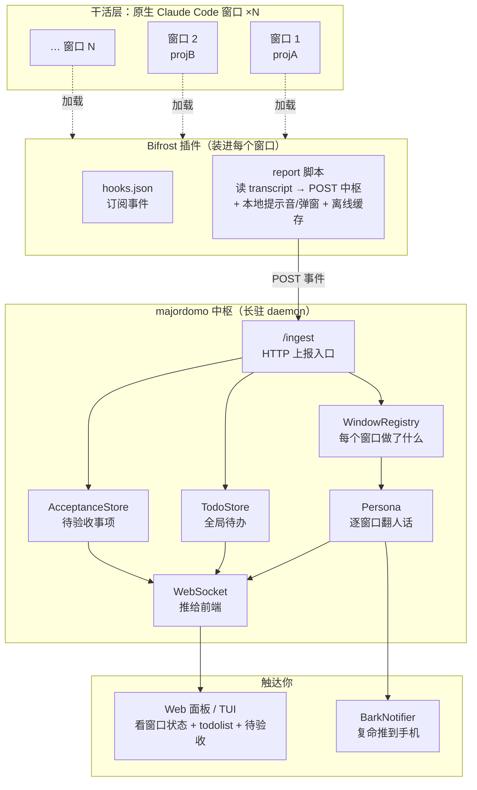
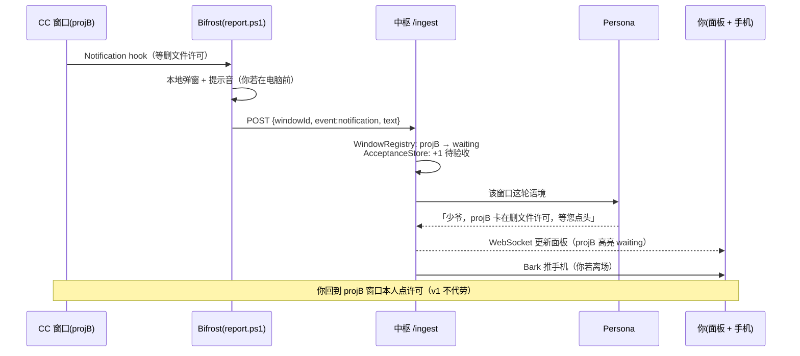
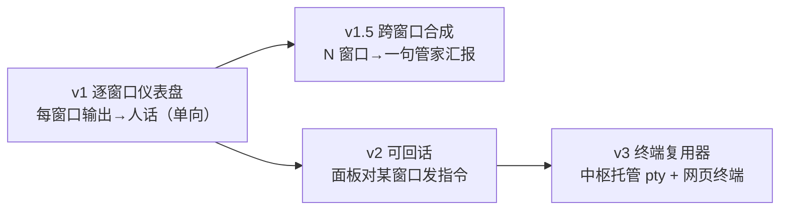

# Bifrost + Hub v1 详尽设计稿

> 承接 `pivot-to-hub.md` 的方向转型，本文是可照着施工的详细设计。
> **本文取代旧稿 `rainbow-hub-v1.md`**：插件更名 rainbow → **Bifrost（虹桥）**，并按 2026-07-02 的转向讨论修订了几处承重设计（见 §0.1）。
> **v1 目标**：本地版仪表盘。中枢记录每个 Claude Code 窗口做了什么、维护一个全局 todolist、追踪待验收事项，用人设口吻逐窗口把技术输出翻成人话，离场时通过 Bark 戳你手机。
> **明确不做**：v1 不托管终端、不代理 pty、不直达窗口敲字，也不做跨窗口合成汇报。但架构留好口子，以后能平滑加上（见「演进」）。

---

## 0. 术语

| 词 | 指什么 |
|---|---|
| **窗口 / Window** | 你手边一个原生 Claude Code 进程。真正干活的工人。majordomo **不驱动**它，只旁观。 |
| **Bifrost（虹桥）** | 装进每个窗口的 Claude Code 插件。用 hook 把窗口活动上报给中枢，并在本地放提示音 / 弹窗。北欧神话里连接人间与神域的彩虹桥——正是「窗口↔中枢」的运输管道。 |
| **中枢 / Hub** | majordomo 转型后的形态。长驻 daemon，汇总所有窗口的上报，维护 todolist 与待验收清单，跑 persona 复命，推 Bark。 |
| **复命 / Persona** | 读窗口的技术输出 → 用人设口吻翻成人话说给你听。中枢的灵魂。 |

一句话分工：**Bifrost 管「一个窗口的即时反馈 + 上报」，中枢管「把技术输出翻成管家人话 + 维护全局待办」。**

### 0.1 相对旧稿（rainbow-hub-v1）的修订

这次转向讨论定下的几处改动，全部已并入下文：

| 点 | 旧稿 | 本稿（现行） | 依据 |
|---|---|---|---|
| 插件名 | rainbow | **Bifrost（虹桥）** | 命名拍板 |
| **v1 persona 职能** | 合成一句跨窗口管家汇报 | **逐窗口人设层**：把每个窗口的本轮输出翻成人话。跨窗口合成推迟 | 「一开始作用很明确，不用合成管家汇报，充当每个窗口输出的人设层」 |
| **todo 归属** | 三路来源混填 | **中枢统一管**。CC 只吐本轮输出，其余交中枢 | 「todo 是中枢来管理的，CC 可以只提供本轮输出」 |
| **todo 填充手段** | 未明确 | **混合**：`TaskCreated`/`TaskCompleted` 走脚本**确定性**增删（不烧 LLM）；LLM 只做人话复命 | 「也不必全是 LLM」 |
| **上报通道** | A(http直连) / B(脚本) 待拍板 | **定路 B：一个脚本包办** | 「一个脚本包办吧」+ §2.3 的硬约束 |

---

## 1. 整体架构



数据单向为主：**窗口 → Bifrost → 中枢 → 你**。v1 不存在「你 → 窗口」的回路（那是终端复用器的事，留给以后）。

---

## 2. Bifrost 插件设计

> **插件怎么被 Claude Code 装上**：开发期最省事——`claude --plugin-dir ./bifrost` 直接从磁盘目录加载，改完 `/reload-plugins` 热载，不必发 marketplace。分发给别人时才走 marketplace / git 仓 / `claude plugin install`。

### 2.1 插件目录结构

```
bifrost/
├─ .claude-plugin/
│  └─ plugin.json          # 清单：唯一放这里的文件。必填只有 name(kebab-case)
├─ hooks/
│  └─ hooks.json           # 订阅哪些事件、command 上报脚本
├─ scripts/
│  ├─ report.ps1           # 读 transcript + 上报 + 提示音/弹窗（Windows；迁移自第二代 notify-done）
│  └─ report.sh            # 跨平台降级（可选）
└─ README.md
```

> 关键：除 `plugin.json` 外，`hooks/` `scripts/` 都在插件**根目录**，不在 `.claude-plugin/` 里。脚本用 `${CLAUDE_PLUGIN_ROOT}/scripts/report.ps1` 引用，shell 形式要加双引号（Windows 路径含空格）。

### 2.2 订阅哪些 hook 事件

Claude Code 的 hook 事件很多，v1 只取**信息价值高、噪音低**的几个：

| 事件 | 拿它干什么 | 用途 |
|---|---|---|
| `SessionStart` | 窗口上线：`session_id` `cwd` `source`（startup/resume） | 中枢注册窗口，报菜名 |
| `Stop` | 一个回合结束 | **上报「这窗口刚做完了什么」** + 本地提示音。⚠️ 见 §2.3 |
| `Notification` | Claude 发通知（等许可 / 等输入） | 上报「窗口卡住了等你」+ 本地弹窗 |
| `TaskCreated` | 窗口内新建任务，带 task 信息 | **脚本确定性喂养 todolist**（不烧 LLM） |
| `TaskCompleted` | 任务完成 | **脚本确定性勾销 todolist** |
| `SessionEnd` | 窗口下线，带 `reason` | 中枢标记窗口离线 |

> 所有 hook 输入都带公共字段：`session_id` `cwd` `transcript_path` `permission_mode` `hook_event_name`。**用 `session_id` 作为窗口 ID**，天然主键。

**刻意不订阅** `PreToolUse` / `PostToolUse`（工具级细节）：太吵，且中枢**不需要知道具体改了什么代码**——只要粗事件。以后要实时细节再加。

### 2.3 上报通道：定为「一个脚本包办」（路 B）

**已拍板走路 B，且这不再是偏好、是硬约束**，原因是一条研究坐实的事实：

> ⚠️ **`Stop` 事件的 payload 里没有助手输出文本**，只有 `session_id / cwd / transcript_path` 等公共字段。要拿「窗口刚说了什么」，**必须去读 `transcript_path` 指向的 `.jsonl`、抠出最后一条 assistant 消息**。

纯 http 直连（旧稿路 A）拿不到输出文本，直接出局。所以：

- **`type: "command"`** 跑 bundled 脚本 `report.ps1`。脚本干四件事：① 从 stdin 读 hook 事件 JSON；② 若是 `Stop`，读 `transcript_path` 抠最后一条 assistant 文本；③ 整形成统一载荷 POST 到中枢 `/ingest`；④ 顺手放本地提示音 / 弹窗（Windows 专属）。
- **韧性**：中枢没开时脚本落盘缓存，下次补送。合「系统要自包含、防御、自愈」的哲学。
- **上报 + 本地副作用 + 读 transcript 单一入口**，一个脚本包办。

> hook 事件数据经 **stdin 以 JSON** 送进脚本；脚本以 **exit code** 回话（0 成功；2 阻断——本插件只上报不阻断，正常返回 0 即可）。

### 2.4 本地副作用

提示音 / 弹窗 **只在 Windows 本机有意义**，是「窗口 → 你就在电脑前」的即时反馈。迁移第二代 `tools/notify-done` 的 PowerShell 逻辑进 `scripts/report.ps1`。

关键认知：**本机提示音（Bifrost 做）和 手机 Bark（中枢做）是两层接力**——你在电脑前靠 Bifrost 提示音；你离场了靠中枢 Bark。不重复。

### 2.5 上报载荷（Bifrost → 中枢）

脚本整形后 POST 给中枢的 body 统一成这个形状：

```jsonc
{
  "windowId": "<session_id>",     // 窗口主键
  "event": "stop | notification | task_created | task_completed | session_start | session_end",
  "cwd": "D:/GitRep/projA",       // 项目路径，报菜名用
  "ts": 1751000000000,
  "payload": {                     // 随事件不同
    "text": "…从 transcript 抠出的最后一条 assistant 文本 / notification 语境…",
    "taskId": "…", "taskDesc": "…", "taskStatus": "…",
    "source": "startup|resume", "reason": "user_exit|…"
  }
}
```

### 2.6 施工第 0 步：探针插件先实测 payload ⚠️

上面的事件表与字段，部分来自文档抓取，**长度可疑、不足全信**。承重事实（`type:http` 存在、`TaskCreated/Completed` 存在、`Stop` 不带文本）我中度信任，但**每个事件的真实 payload 形状必须实测**。

因此 v1 第一件事不是写正式插件，而是写一个**探针插件**：一个 10 行的 `report.ps1`，把每个 hook 的 stdin 原样 `>> dump.jsonl`。装上、开一个真实窗口干点活、看 dump 里各事件到底长什么样，再据实回填 §2.2/§2.5。**用「加日志定位」代替「拿文档当真」**，这是 bug-fixing 哲学的前置应用。

---

## 3. 中枢（Hub）设计

中枢是 majordomo 现有 daemon 的**收缩 + 转向**：砍掉「自己驱动工作层」，加上「接收上报 + 维护三张表 + 逐窗口复命」。

### 3.1 新增：`/ingest` HTTP 入口

现有 Web 层（`src/web/server.ts`）已有 `/healthz` `/readyz`，在同一 HTTP server 上加一个 **`POST /ingest`** 接收 Bifrost 上报。收到后：归一 → 更新三张表 → 视事件触发 persona → WebSocket 广播给前端。

> **端口**：daemon 默认 4317 撞了本机 WXWork（见 memory）。v1 统一另挑不冲突端口（如 4350 一带），做成配置项，Bifrost 上报地址读同一配置。

### 3.2 三张表（v1 的核心数据）

**① WindowRegistry —— 每个窗口做了什么**

```jsonc
{
  "windowId": "…",
  "cwd": "D:/GitRep/projA",
  "title": "projA",              // cwd 尾段自动命名（v1 不手动起名）
  "state": "working | waiting | idle | offline",
  "lastEvent": "stop",
  "lastText": "重构完成了 X",     // 最近一次 assistant 文本摘要
  "activity": [ /* 事件流：ts + event + 摘要，滚动保留最近 N 条 */ ],
  "onlineSince": 1751000000000,
  "updatedAt": 1751000000000
}
```

`state` 由事件推导：`Stop`→idle、`Notification`→waiting（多半等你许可）、`SessionEnd`→offline。

**② TodoStore —— 全局待办（中枢统一管）**

v1 明确：**todo 归中枢管，CC 只吐本轮输出**。填充分两条，一条不烧 LLM：

- **确定性路（主）**：`TaskCreated` → 增一条 open；`TaskCompleted` → 勾销为 done。脚本触发、中枢直接落库，**不经 LLM**。
- **人话路（辅）**：persona 读窗口活动时可补充「隐含待办」；你手动增删。

```jsonc
{
  "id": "…",
  "text": "给 projB 补权限确认流程",
  "windowId": "…",          // 来自哪个窗口，可空（手动/跨窗口）
  "status": "open | done",
  "source": "task_hook | persona | manual",   // task_hook = 确定性路
  "createdAt": …, "doneAt": …
}
```

**③ AcceptanceStore —— 待验收事项**

「要你 review / 拍板」的事。v1 判定来源：`Notification`（窗口等许可 = 需你介入）、persona 判定「这改动建议你扫一眼」、你手动标记。

```jsonc
{
  "id": "…",
  "windowId": "…",
  "what": "5 号窗口卡在删文件的权限确认",
  "kind": "permission | review | decision",
  "status": "pending | resolved",
  "createdAt": …
}
```

> v1 的验收是**追踪与提醒**，不是「在中枢里点批准」——你还是回窗口本人处理（v1 不直达）。中枢的价值是「不让任何窗口的卡点被你漏掉」。

### 3.3 Persona 复命层（v1 = 逐窗口人设层）

现有 `PersonaEngine`（`ApiPersona` / `TemplatePersona`）**接口不变**。v1 的职能是**逐窗口**的：某窗口 `Stop`，中枢拿它这轮的技术输出 → persona 用人设口吻翻成一句人话 → 推给面板 / Bark。

- **v1 不做跨窗口合成**。旧稿设想的「少爷，3 号好了、5 号卡住、2 号建议您看」那种一句话统揽 N 窗口，**推迟到 v1.5**。先把「每个窗口的技术输出 → 人话」这条单窗口链路跑通，价值立现、管道同构，以后加合成不推翻。
- **它和 output-style 的区别**（即为何非中枢做不可）：output-style 只换*同一个*干活 agent 的语气，且污染它干活的上下文；中枢 persona 用**便宜模型、在中枢侧、集中**处理，不碰干活大模型。这仍是单窗口插件天花板外的事。
- **节流**：8 窗口高频 `Stop` 若每条都翻+推会吵。合成频率 / 触发条件要调（见 §8 风险）。

### 3.4 Bark 推送（新 Notifier）

新增 `BarkNotifier implements Notifier`（接口 `src/notify/types.ts` 早留好口子）。persona 的人话 → POST 到 Bark push URL → 手机弹出。

- 配置：Bark base URL + device key（放 config / env，别进仓）。
- 挂进现有 `NotifierBus`，与 `ConsoleNotifier` 并列；服务器 profile 下关掉 PowerShell（无桌面全废），Bark 成唯一出口——v1 本地版可先不做，配置结构留好。
- 节流：和 persona 同频，别把手机炸了。

---

## 4. 数据流（一个典型场景）



---

## 5. 与现有代码的关系

| 现有部件 | v1 处置 |
|---|---|
| `daemon.ts` + WebSocket | **保留**。加 `/ingest`、加窗口/todo/验收广播消息。 |
| `web/server.ts`（含 healthz） | **保留复用**。同 HTTP server 上加 `/ingest`。面板改成展示三张表。 |
| `Store`（JSON 持久化） | **保留复用**。新增 windows / todos / acceptance 三份 JSON。 |
| `Config` + profile | **保留**。加 Bark 配置、ingest 端口、服务器/本机 notify 差异。 |
| `PersonaEngine` | **保留、升级输入**（单会话 → 逐窗口语境）。接口不动。 |
| `NotifierBus` + `types.ts` | **保留**。新增 `BarkNotifier`。 |
| `SdkWorker` / `MockWorker` / `factory` | **退役为可选**。v1 干活交给原生窗口；SdkWorker 不再是主路径（保留代码，非默认）。 |
| `Session` / `SessionManager` | **大幅退场**。v1「会话」被「窗口（外部 CC）」取代；`SessionInfo` 可为 Window 复用改造。 |
| `protocol/messages.ts` | **扩展**。加 window / todo / acceptance 的 Server→Client 消息；加面板增删 todo / 标记验收的 Client→Server 消息。 |

**净新增模块**：`ingest` 入口、`WindowRegistry`、`TodoStore`、`AcceptanceStore`、`BarkNotifier`、`bifrost/` 插件（monorepo 子目录，零中枢依赖，未来可 subtree split 拆独立仓——见 §8）。

---

## 6. 配置增补（示意，非最终字段表）

```jsonc
{
  "port": 4350,                    // 避开 WXWork 占用的 4317
  "hub": { "ingestPath": "/ingest" },
  "bark": {
    "baseUrl": "https://api.day.app",   // 或自建 Bark server
    "deviceKey": "…（放 env，别进仓）"
  },
  "notify": {
    "local": ["powershell", "console"],  // 本机
    "server": ["bark", "console"]        // 服务器 profile：无 PowerShell
  }
}
```

Bifrost 插件侧也需一个上报地址配置（中枢的 `http://host:port/ingest`），随插件走。

---

## 7. 演进：仪表盘 → 跨窗口合成 → 终端复用器

v1 是**逐窗口只读仪表盘**（窗口→你 单向）。两条正交的加法，都不推翻架构：



- **v1.5（跨窗口合成）**：persona 输入从「单窗口语境」升级为「所有窗口活动快照 + 待验收清单」，合成一句统揽。纯中枢侧改动，管道不变。
- **v2（可回话）**：给中枢加「向某窗口投递指令」能力。触及「代理输入」的坑，届时评估。
- **v3（终端复用器）**：中枢托管服务器 pty + 网页终端（类 ttyd 带管家大脑）。`pivot-to-hub.md` 说的完全体。

**v1 留好的口子**：通信层已是 WebSocket（能走网络）、窗口有稳定主键（session_id）、notifier 可插拔（Bark 已接）、persona 接口不变（换输入即升级）。这四样让后续都是「加」而非「重写」。

---

## 8. 已拍板 & 风险

**已拍板（2026-07-02）：**
1. **Bifrost 放 monorepo 子目录 `bifrost/`**（非独立仓）。理由：v1 上报协议未稳，插件与中枢共享协议、一起演进、一个 PR 对齐，省掉双仓同步摩擦。**约束**：插件目录必须**零中枢依赖**——只依赖「一个能 POST 的 `/ingest` URL」，绝不 `import` 中枢任何 TS 模块，保持纯脚本 + 一个上报地址配置。这样未来真要单独分发时 `git subtree split` 即可零成本拆成独立仓（反向合并才麻烦）。分发本就不受子目录影响：marketplace / git 仓直装都支持仓内子路径，本地 `--plugin-dir ./bifrost` 更是直接指目录。
2. **窗口命名：`cwd` 尾段自动命名**。不做面板手动起名。多个同项目窗口会重名，v1 接受（真正主键是 `session_id`，标题重名只影响显示）。

**风险 / 限制：**
- **hook payload 形状未实测**：文档抓取来的事件表/字段可疑。§2.6 的探针插件是消除此风险的第 0 步，务必先做。
- **`Stop` 不带输出文本**：必须读 `transcript_path`。解析 `.jsonl` 抠最后一条 assistant 消息的逻辑要防御性（格式随 CC 版本演进）。
- **`TaskCreated`/`TaskCompleted` 版本依赖**：较新事件，缺失字段要降级，别硬依赖。
- **persona 节流**：8 窗口高频活动每条都翻+推会吵。频率 / 触发条件是体验成败关键。
- **上报安全**：v1 本地 localhost 无妨；中枢一上服务器，`/ingest` 必须加鉴权（token / CF Access），否则谁都能往你 todolist 灌数据。
