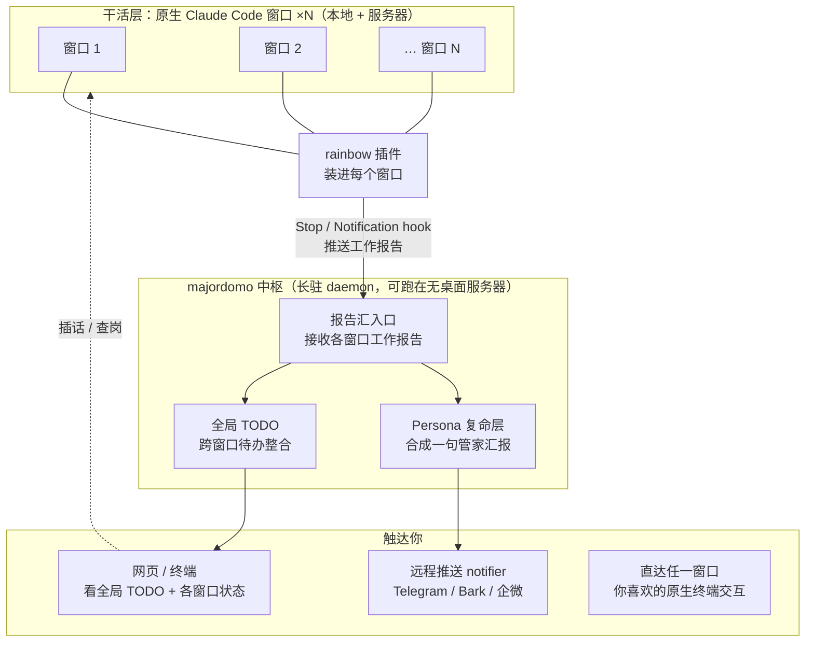

# 转型：从「调度器」到「管家中枢」

> 承接 `main-mind.md` 的初始设计。本文记录一次方向转型，不回改历史判断。
> 起因：日常同时开 8 个 Claude Code 窗口，原生交互远好过自建 SdkWorker。

## 一句话

majordomo 不再自己驱动工作层干活，转型成**管家中枢**：真正干活的是你手边一群原生 Claude Code 窗口，majordomo 负责**汇总、维护全局 TODO、用人设口吻向你复命、并在你离场时触达你**。

## 为什么转

- **SdkWorker 的交互干不过原生 Claude Code**。自己复刻一个「无头 + 自建 TUI」的工作层，体验永远追不上官方那个持续迭代的终端。硬做是逆水行舟。
- **Claude Code 已经出厂了扩展能力**。hooks / slash commands / MCP / subagents / output style —— majordomo 原来自建的 Hook 层、通知层，本质是在重造官方免费的轮子，且享受不到上游更新。
- **但有两件事插件天花板做不到**，这才是 majordomo 存在的唯一理由：
  1. **跨窗口的 persona 复命**：output style 只是换*同一个* agent 的语气；persona 是*另一层*同时读 N 个窗口的输出、合成**一句管家汇报**。单个窗口的 hook 没有跨窗口视野，合成不了这句话。
  2. **全局 TODO + 常驻中枢 + 多前端查岗**：单个窗口不知道别的窗口在忙什么；只有一个常驻中枢能维护跨窗口待办，并让你从终端 / 网页 / 手机连上同一份状态。

**分工，不是二选一**：插件负责增强「干活的 agent」，中枢负责「把 N 个 agent 拧成一个管家声音」。

## 新架构

## 各部件的去留

| 部件 | 处置 | 说明 |
|---|---|---|
| **SdkWorker** | 退役为可选 / mock | 日常干活交给原生 Claude Code 窗口；SdkWorker 不再是主路径。 |
| **rainbow 插件**（新） | 新建 | 装进每个 Claude Code 窗口，用 hook 把工作报告推给中枢。是「窗口 → 中枢」的运输管道。 |
| **Persona 复命层** | **保留，核心** | 从「读单会话输出」升级为「读 N 个窗口的报告、合成一句管家汇报」。majordomo 的灵魂。 |
| **全局 TODO**（新） | 新建 | 中枢维护的跨窗口待办。只有中枢有这个视野。 |
| **daemon + WebSocket + 多前端** | **保留，核心** | 常驻中枢 + 终端/网页/手机连同一份状态。护城河，插件生态不提供。 |
| **Hook / notify（自建部分）** | 尽量下放 | diary / shell / report 能交给 Claude Code 原生 hooks 的就交出去，中枢侧做薄。 |
| **PowershellNotifier** | 本机专属 | 服务器无桌面时全废，见下。 |

## hook 与 persona 不冲突

- **hook 是运输管道**：窗口干完活，Stop hook 触发，把*原始技术输出*推给中枢。这个 hook 确实能干。
- **persona 是大脑**：同时看 N 个窗口的报告，合成「少爷，3 号重构好了；5 号卡在权限确认等您点头；2 号建议您扫一眼」。**这句话 hook 做不到，只有中枢里的 persona 能做。**

## 服务器场景戳破的缺口

原设计隐含假设 daemon 跑在 Windows 本机，「推手机」只是锦上添花的第二出口。新场景下 daemon 跑在**无桌面服务器**：

- `PowershellNotifier`（声音 / toast / TTS）在服务器上**全废**——那是 Windows 本机专属。
- 服务器要触达你，**唯一出口**是远程推送 notifier（Telegram / Bark / 企微机器人：服务器 curl 一个 webhook，消息到手机）。它从「第二出口」变成服务器场景下**唯一能触达你的出口**。

好消息：`src/notify/types.ts` 的 `Notifier` 接口早就为此留好了口子（注释已写明「未来推手机」）。**这不是架构问题，是组装问题**——服务器 profile 下的 notify 链要能关掉 PowerShell、挂上远程推送 notifier，否则服务器干完活你收不到任何信号。

## 图形界面 vs 无桌面服务器

关键区分：**GUI 跑在哪 ≠ 服务器要不要桌面**。

- daemon 在服务器上是**纯 headless Node 进程**（现在就是），吐 HTML + WebSocket 数据。
- 图形界面由**你的浏览器**渲染。服务器只有终端，完全够，而且是对的——别给服务器装桌面。
- 现有 Web 层（`src/web/server.ts` 注入 `{{WS_URL}}`）的架子正是干这个的，保留。

## 触达的两种情况

| 场景 | 「直达窗口」怎么做 | 难度 |
|---|---|---|
| **本地窗口** | 中枢只需告诉你「该看哪个」，你 alt-tab 过去。hook 单向上报即可。 | 轻 |
| **服务器窗口** | 你人不在，要直达就得中枢托管 pty 会话 + 网页终端（类 ttyd，但带管家大脑）。SdkWorker 那个「代理真实终端」的坑会换形式回来。 | 重 |

**是「服务器窗口 + 直达」这个需求单方面把项目推向重的那条路。** 纯本地的话，中枢就是个不碰终端的仪表盘，很轻。

## 待拍板

1. **仪表盘 vs 终端复用器**：中枢只做「上报 / 汇总 / 复命 / 喊你去哪个窗口」（轻，服务器窗口用现成 tmux/ttyd 自己连），还是亲自托管服务器 pty、网页手机直达任一窗口敲字（重，但才是「随处查岗 + 直达」完全体）？取决于你 8 个窗口有多少想扔服务器挂机。
2. **远程推送 notifier 选型**：Telegram / Bark / 企微机器人三选一（memory 记着本机装着企微）。
3. **rainbow 插件的报告协议**：窗口用哪个 hook 事件、推什么格式给中枢汇入口。
