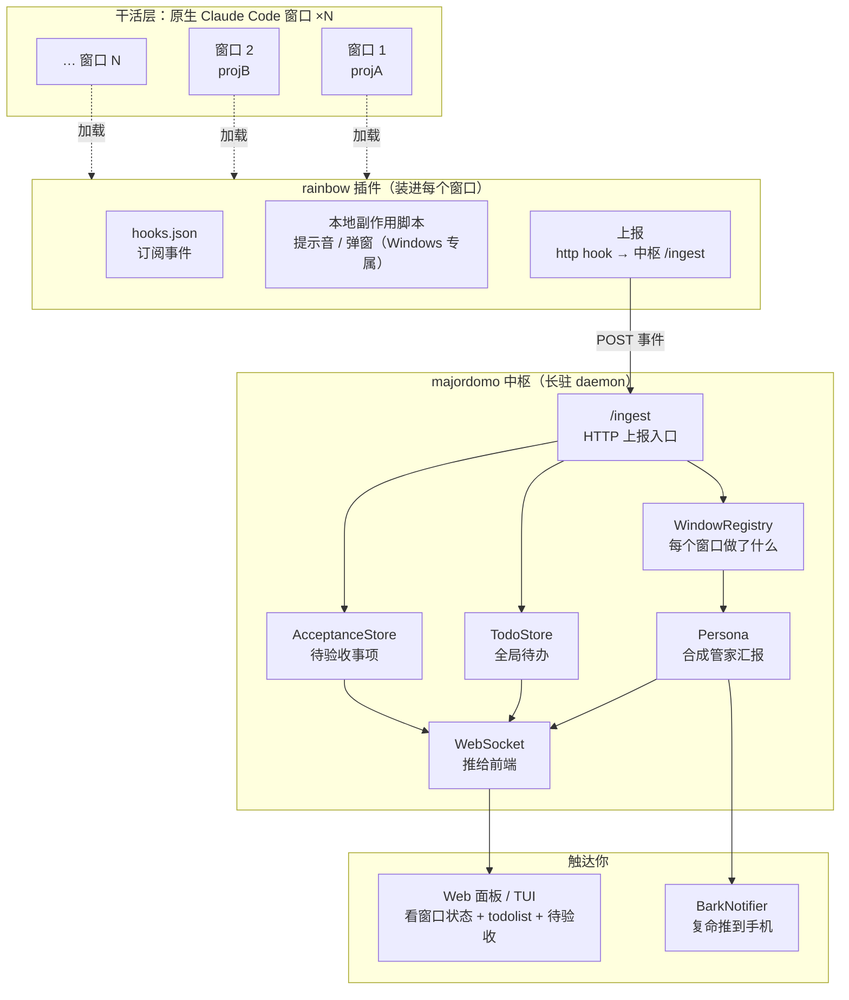
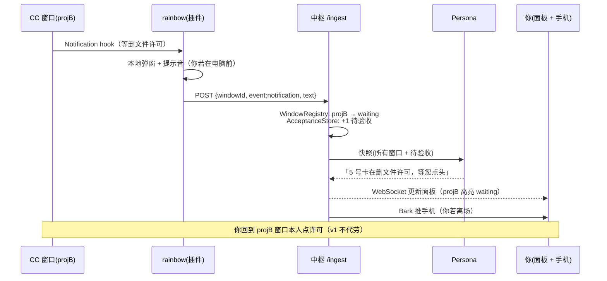
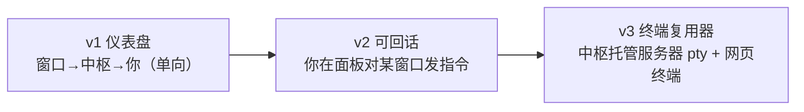

# Rainbow + Hub v1 详尽设计稿

> 承接 `pivot-to-hub.md` 的方向转型，本文是可照着施工的详细设计。
> **v1 目标**：本地版仪表盘。中枢记录每个 Claude Code 窗口做了什么、维护一个全局 todolist、追踪待验收事项，用人设口吻向你复命，离场时通过 Bark 戳你手机。
> **明确不做**：v1 不托管终端、不代理 pty、不直达窗口敲字。但架构留好口子，以后能平滑转成终端复用器（见「演进」）。

---

## 0. 术语

| 词 | 指什么 |
|---|---|
| **窗口 / Window** | 你手边一个原生 Claude Code 进程。真正干活的工人。majordomo **不驱动**它，只旁观。 |
| **rainbow（虹）** | 装进每个窗口的 Claude Code 插件。用 hook 把窗口活动上报给中枢，并在本地放提示音 / 弹窗。 |
| **中枢 / Hub** | majordomo 转型后的形态。长驻 daemon，汇总所有窗口的上报，维护 todolist 与待验收清单，跑 persona 复命，推 Bark。 |
| **复命 / Persona** | 读 N 个窗口的活动，合成**一句管家汇报**说给你听。中枢的灵魂。 |

一句话分工：**rainbow 管「一个窗口的即时反馈 + 上报」，中枢管「把 N 个窗口拧成一个管家声音」。**

---

## 1. 整体架构



数据单向为主：**窗口 → rainbow → 中枢 → 你**。v1 不存在「你 → 窗口」的回路（那是终端复用器的事，留给以后）。

---

## 2. rainbow 插件设计

### 2.1 插件目录结构

```
rainbow/
├─ .claude-plugin/
│  └─ plugin.json          # 清单：name=rainbow，声明 hooks
├─ hooks/
│  └─ hooks.json           # 订阅哪些事件、http 上报 + 本地脚本
├─ scripts/
│  ├─ notify.ps1           # 提示音 / 弹窗（Windows；迁移自第二代 notify-done）
│  └─ notify.sh            # 跨平台降级（可选）
└─ README.md
```

清单只需 `name`；hooks 既可写在 `plugin.json` 里，也可单列 `hooks/hooks.json`（推荐后者，清爽）。插件内脚本用 `${CLAUDE_PLUGIN_ROOT}` 引用，shell 形式要加引号。

### 2.2 订阅哪些 hook 事件

Claude Code 的 hook 事件很全，v1 只取**信息价值高、噪音低**的几个：

| 事件 | 拿它干什么 | 用途 |
|---|---|---|
| `SessionStart` | 窗口上线：拿到 `session_id` `cwd` `source`（startup/resume） | 中枢注册一个窗口，报菜名 |
| `Stop` | 一个回合结束，带 `assistant_message` | **上报「这个窗口刚做完了什么」** + 本地提示音 |
| `Notification` | Claude 发通知（常是等许可 / 等输入），带 `message` | 上报「窗口卡住了等你」+ 本地弹窗 |
| `TaskCreated` | 窗口内新建了任务，带 `task_id` `task_description` | **自动喂养 todolist** |
| `TaskCompleted` | 任务完成，带 `task_id` `task_status` | todolist 自动勾销 |
| `SessionEnd` | 窗口下线，带 `reason` | 中枢标记窗口离线 |

> 全部 hook 输入都带公共字段：`session_id` `cwd` `transcript_path` `permission_mode` `hook_event_name`。这就是中枢识别「哪个窗口」的天然主键——**用 `session_id` 作为窗口 ID**。

**刻意不订阅** `PreToolUse` / `PostToolUse`：太吵，每个工具调用都触发，v1 不需要这个粒度。以后要「窗口在干嘛」的实时细节再加。

### 2.3 上报通道：两种做法（**待你拍板**）

rainbow 要把事件送到中枢。两条路，各有取舍：

**路 A：`type: "http"` 直连（零脚本）**
hook 里直接声明 http，Claude Code 把事件 JSON POST 到中枢 `/ingest`。

- ✅ 最简单，无脚本无依赖，跨平台一致。
- ❌ 中枢没开时消息直接丢（无离线缓存 / 重试）。
- ❌ 载荷是 Claude Code 定的原始 hook JSON，中枢照单接收。

**路 B：`type: "command"` + 小脚本（带韧性）**
hook 跑一个 bundled 脚本，脚本读 stdin JSON → POST 中枢，顺便本地提示音 / 弹窗。

- ✅ 自包含、防御性：中枢没开可落盘缓存、下次补送；可整形载荷。
- ✅ 上报 + 本地副作用一个脚本搞定，单一入口。
- ❌ 要写脚本、处理跨平台（Windows 用 .ps1 / 其余 .sh）。

**我的建议**：**本地副作用（提示音/弹窗）必须走 command**（那是本机动作，http 干不了）；**上报**用哪条看你想要多强的韧性。最省心是「提示音脚本」和「http 上报」并列两个 hook；最健壮是「一个 command 脚本包办上报+副作用+离线缓存」。按你「系统要自包含、防御、自愈」的哲学，我倾向**路 B 一个脚本包办**，但它工作量更大。这是 v1 第一个要你定的点。

### 2.4 本地副作用

提示音 / 弹窗 **只在 Windows 本机有意义**，是「窗口 → 你本人就在电脑前」的即时反馈。迁移第二代 `tools/notify-done` 的 PowerShell 逻辑进 `scripts/notify.ps1`。

关键认知：**本机提示音（rainbow 做）和 手机 Bark（中枢做）是两层不同触达**——你在电脑前靠 rainbow 提示音；你离场了靠中枢 Bark。两者不重复，是接力。

### 2.5 上报载荷（rainbow → 中枢）

无论走 http 还是 command，POST 给中枢的 body 统一成这个形状（脚本可整形，http 则由中枢从原始 hook JSON 归一）：

```jsonc
{
  "windowId": "<session_id>",     // 窗口主键
  "event": "stop | notification | task_created | task_completed | session_start | session_end",
  "cwd": "D:/GitRep/projA",       // 项目路径，报菜名用
  "ts": 1751000000000,
  "profile": "claude",            // 可选，若插件能拿到
  "payload": {                     // 随事件不同
    "text": "…assistant_message / notification message…",
    "taskId": "…", "taskDesc": "…", "taskStatus": "…",
    "source": "startup|resume", "reason": "user_exit|…"
  }
}
```

---

## 3. 中枢（Hub）设计

中枢是 majordomo 现有 daemon 的**收缩 + 转向**：砍掉「自己驱动工作层」，加上「接收上报 + 维护三张表 + 复命」。

### 3.1 新增：`/ingest` HTTP 入口

现有 Web 层（`src/web/server.ts`）已有 `/healthz` `/readyz`，在同一 HTTP server 上加一个 **`POST /ingest`** 接收 rainbow 上报即可。收到后：归一 → 更新 WindowRegistry / TodoStore / AcceptanceStore → 触发 persona（视事件）→ 通过 WebSocket 广播给前端。

> **端口**：daemon 默认 `4317`，但你本机 WXWork 占了 4317（见 memory）。v1 建议 ingest / WebSocket / Web 面板统一另挑一个不冲突端口（如 4350 一带），做成配置项，rainbow 的上报地址也读同一配置。

### 3.2 三张表（v1 的核心数据）

**① WindowRegistry —— 每个窗口做了什么**

```jsonc
{
  "windowId": "…",
  "cwd": "D:/GitRep/projA",
  "title": "projA",              // 从 cwd 推，或你手动命名
  "profile": "claude",
  "state": "working | waiting | idle | offline",
  "lastEvent": "stop",
  "lastText": "重构完成了 X",     // 最近一次 assistant_message 摘要
  "activity": [ /* 事件流：ts + event + 摘要，滚动保留最近 N 条 */ ],
  "onlineSince": 1751000000000,
  "updatedAt": 1751000000000
}
```

`state` 由事件推导：`Stop`→idle/working、`Notification`→waiting（多半在等你许可）、`SessionEnd`→offline。

**② TodoStore —— 全局待办**

来源三路：`TaskCreated`/`TaskCompleted` 自动填充与勾销；persona 归纳窗口活动时补充；你手动增删。

```jsonc
{
  "id": "…",
  "text": "给 projB 补权限确认流程",
  "windowId": "…",          // 来自哪个窗口，可空（手动/跨窗口）
  "status": "open | done",
  "source": "task_hook | persona | manual",
  "createdAt": …, "doneAt": …
}
```

**③ AcceptanceStore —— 待验收事项**

「要你 review / 拍板」的事。v1 判定来源：`Notification` 事件（窗口在等许可 = 需要你介入）、persona 判定「这个改动建议你扫一眼」、你手动标记。

```jsonc
{
  "id": "…",
  "windowId": "…",
  "what": "5 号窗口卡在删文件的权限确认",
  "kind": "permission | review | decision",
  "status": "pending | resolved",
  "createdAt": …
}
```

> v1 的验收是**追踪与提醒**，不是「在中枢里点批准」——你还是回到那个窗口本人处理（v1 不直达窗口）。中枢的价值是「不让任何一个窗口的卡点被你漏掉」。

### 3.3 Persona 复命层（保留，升级）

现有 `PersonaEngine`（`ApiPersona` / `TemplatePersona`）**接口不变**，但**输入从「单会话输出」升级为「多窗口活动快照」**。

- **触发**：不再是每个窗口的每个 Stop 都立即长篇汇报（会吵死）。改为**合成式**——攒一小段窗口、或遇到 `Notification`（有窗口卡住）这类要紧事件时，让 persona 读**当前所有窗口的活动快照 + 待验收清单**，合成一句：

  > 「少爷，3 号那个重构好了；5 号卡在删文件的权限确认上等您点头；2 号建议您扫一眼，它的改法有点野。」

- **单窗口 hook 做不到这句话**——它没有跨窗口视野。这正是中枢存在的唯一理由，务必是中枢内的 persona 做。

### 3.4 Bark 推送（新 Notifier）

新增 `BarkNotifier implements Notifier`（接口 `src/notify/types.ts` 早留好口子）。persona 合成的复命 → POST 到 Bark server 的 push URL → 你手机弹出。

- 配置：Bark 的 base URL + device key（放 config / env，别进仓）。
- 挂进现有 `NotifierBus`，与 `ConsoleNotifier` 并列；**服务器 profile 下关掉 PowerShell（无桌面全废），Bark 成唯一出口**——这条 v1 本地版可先不做，但配置结构留好。
- 推送节流：和 persona 合成同频，避免 8 个窗口各推一条把你手机炸了。

---

## 4. 数据流（一个典型场景）



---

## 5. 与现有代码的关系

| 现有部件 | v1 处置 |
|---|---|
| `daemon.ts` + WebSocket | **保留**。加 `/ingest`、加窗口/todo/验收相关广播消息。 |
| `web/server.ts`（含 healthz） | **保留复用**。同 HTTP server 上加 `/ingest`。面板改成展示三张表。 |
| `Store`（JSON 持久化） | **保留复用**。新增 windows / todos / acceptance 三份 JSON。 |
| `Config` + profile | **保留**。加 Bark 配置、ingest 端口、服务器/本机 notify 差异。 |
| `PersonaEngine` | **保留、升级输入**（单会话 → 多窗口快照）。接口不动。 |
| `NotifierBus` + `types.ts` | **保留**。新增 `BarkNotifier`。 |
| `SdkWorker` / `MockWorker` / `factory` | **退役为可选**。v1 干活交给原生窗口；SdkWorker 不再是主路径（保留代码，非默认）。 |
| `Session` / `SessionManager`（驱动逻辑） | **大幅退场**。v1 的「会话」概念被「窗口（外部 CC）」取代；驱动型 Session 不再是核心。`SessionInfo` 结构可为 Window 复用改造。 |
| `protocol/messages.ts` | **扩展**。加 window / todo / acceptance 的 Server→Client 消息；加你在面板增删 todo / 标记验收的 Client→Server 消息。 |

**净新增模块**：`ingest` 入口、`WindowRegistry`、`TodoStore`、`AcceptanceStore`、`BarkNotifier`、`rainbow/` 插件（独立目录，甚至可独立仓）。

---

## 6. 配置增补（示意，非最终字段表）

```jsonc
{
  "port": 4350,                    // 避开 WXWork 占用的 4317
  "hub": {
    "ingestPath": "/ingest"
  },
  "bark": {
    "baseUrl": "https://api.day.app",   // 或自建 Bark server
    "deviceKey": "…（放 env，别进仓）"
  },
  "notify": {
    "local": ["powershell", "console"],  // 本机
    "server": ["bark", "console"]        // 服务器 profile：无 PowerShell
  }
}
```

rainbow 插件侧也需一个上报地址配置（中枢的 `http://host:port/ingest`），随插件走。

---

## 7. 演进：仪表盘 → 终端复用器

v1 是**只读仪表盘**（窗口→你 单向）。以后要「随处直达任一窗口敲字」，是加一条**反向回路**，架构不推翻：



- **v2**：给中枢加「向某窗口投递指令」的能力。最轻做法是窗口侧 rainbow 起一个小监听（或轮询中枢取指令）——但这已触及「代理输入」的坑，届时再评估。
- **v3**：中枢亲自托管服务器上的 pty 会话 + 网页终端（类 ttyd，带管家大脑）。这才是 `pivot-to-hub.md` 说的完全体，也是 SdkWorker「代理真实终端」的坑换形式回来的地方。

**v1 留好的口子**：通信层已是 WebSocket（能走网络）、窗口有稳定主键（session_id）、notifier 可插拔（Bark 已接）。这三样让 v2/v3 是「加回路」而非「重写」。

---

## 8. 待拍板 & 风险

**要你拍板：**
1. **上报通道**（§2.3）：路 A http 直连（简单、丢消息）／路 B command 脚本（健壮、要写脚本）。我倾向 B，但 A 能更快跑通。
2. **rainbow 独立仓还是 monorepo 子目录**？独立仓利于单独分发给别人装；子目录利于和中枢协议同步演进。
3. **窗口命名**：`cwd` 尾段自动命名够用，还是要你在面板手动给窗口起名（多个同项目窗口会重名）？

**风险 / 限制：**
- **多窗口同 `session_id` 唯一性**：靠 CC 的 session_id 做主键，同一项目开多窗口不会撞（各有独立 session_id），但 `--resume` 同一会话到不同窗口可能撞——需 v1 验证。
- **hook 版本依赖**：事件名 / 载荷字段随 Claude Code 版本演进（`TaskCreated` 等较新）。rainbow 要对缺失字段防御性降级，别硬依赖。
- **persona 节流**：8 窗口高频活动若每条都触发复命+Bark，会吵。合成频率 / 触发条件要调，是体验成败关键。
- **上报安全**：v1 本地 localhost 无妨；一旦中枢上服务器，`/ingest` 必须加鉴权（token / CF Access），否则谁都能往你 todolist 灌数据。
