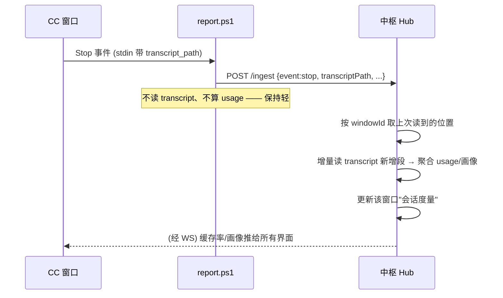

# 会话度量 v1：缓存率 + 会话画像

> 承接 `bifrost-hub-v1.md`。目标：让指挥官（中枢）在所有界面里**记录并报告每个窗口的缓存命中率**，顺带把 transcript 里能白拿的会话画像信号一起收进来，"更了解每个会话"。
> 起点是 `docs/research/deepseek-cache-miss.md`——那次追查确认了缓存 miss 会让长会话又慢又贵，本文把"事后翻日志"变成"中枢实时旁观"。

---

## TL;DR

- **钥匙**：hook stdin 不带 usage，但每个事件都带 `transcript_path`。它指向的 jsonl 里，每条 assistant 消息自带 `message.usage`，缓存率就在里面。
- **关键坑（本文的承重决定）**：一次 Stop **不等于**一轮 assistant。autonomous loop 里，一个 Stop 段可含**上百条** assistant，而 miss 大多埋在中间轮——**"只读尾部一条"会系统性漏掉塌方**（实测见 §2）。
- **定路**：ps1 保持轻，**不读 transcript、不算 usage**，只在事件里把 `transcript_path` 带给中枢；**读取 + 增量聚合全放中枢**（长驻 Node，能按窗口记读取位置、攒历史）。
- **采集**：§1 信号**全上**；两个重点——**每轮耗时**（时间戳差，缓存失效预警）和**总轮数**（判"该拆短了"）提为一等公民。
- **v1 只显示数值、不判定**：各界面原样显示 miss% / 轮数 / 耗时等，你看真实分布后再定阈值。
- **产出**：中枢每窗口维护一份"会话度量"，缓存率 + 画像在 TUI / Web / Bark 三处都能看。

---

## 一、能从 transcript 白拿的信号

一条 `~/.claude/projects/**/<session>.jsonl` 就是整个会话的全量记录。每条 assistant 消息 + 旁边的元记录，实测能拿到这些（数据来自 terrarium `479291e5`，532 轮、47 分钟那条最炸的会话）：

**全上**——下表信号全部采集。两个被特别点名、地位提升的：

- **assistant 时间戳差**（相邻 assistant 记录时间差）→ 不只是"耗时代理"，实测它是**缓存失效的先行/伴随信号**：miss 轮重算十几万 token，耗时会从中位 1.6s 跳到 300s+。把它和单轮 miss% 摆一起，能相互印证"这轮是不是真塌了"，也能在 usage 还没算完前先感知异常。
- **总轮数**（该会话 assistant 记录条数，如 532）→ **一等公民**，直接进 WindowRegistry。deepseek 文档的核心止损就是"长会话缓存固化差、该拆短"，轮数是判断"这条会话滚太久了"最直接的标尺。

| 层 | 信号 | 来源字段 | 价值 |
|---|---|---|---|
| **缓存健康** | 单轮 miss% | `usage.input_tokens / (input+cache_read)` | 本文主目标 |
| | 段内塌方峰值 | 段内最大单轮 `input_tokens` | 一次重算多少万 token |
| | 累计 output | `usage.output_tokens` | 产出/成本 |
| **规模** ★ | **总轮数** | assistant 记录条数 | 一等公民；判"该拆短了"的标尺 |
| | 会话时长 | 首末时间戳差 | 配合轮数看规模 |
| **时序** ★ | **每轮耗时** | 相邻 assistant 时间戳差 | **缓存失效预警**：miss→重算→耗时跳升 |
| **会话画像** | 人话标题 | `ai-title` 记录 | 窗口"在做什么"，比事件推导的 state 准 |
| | 工具用量直方图 | assistant 里的 `tool_use` name | 会话性格：重读/重写/重查 |
| | 项目 / 分支 | `cwd` / `gitBranch` | 在哪干活 |
| | 是否无人值守 | `permissionMode`（如 `bypassPermissions`） | 长自动循环的标志 |
| **健康** | 工具循环占比 | `stop_reason`（`tool_use` vs `end_turn`） | 96% tool_use = 典型 loop |
| | 巨型 turn | `system/turn_duration.durationMs` | 抓到过单 turn 42 分钟 |
| | 工具报错 | `toolUseResult.is_error / stderr` | 会话是否在踩坑 |
| | hook 自身报错 | `hookErrors`（抓到过 `JSON validation failed`） | 连 hook 出错也可见 |

> ★ = 你点名要重点记的。
> `cache_creation_input_tokens` 恒为 0（deepseek 直连的坑），miss% 只能用 `input/(input+cache_read)` 口径。

---

## 二、承重坑：一个 Stop 有很多 assistant

这是本方案区别于"顺手读尾部"的核心。**实测 `479291e5`**：

- 9 次 `end_turn`（≈9 次 Stop），但每段 assistant 数：**中位 1，max 237**。一次 autonomous loop 从用户输入到最终 Stop，中间能塞进上百条工具轮。
- **"只读尾部那条"抓 miss 的效果**：

| | 数量 |
|---|---|
| 有 miss 的 Stop 段 | 5 |
| 尾部(end_turn)那条本身是 miss | 2 |
| **miss 只在中间、尾部却是 hit** | **3** ← 只读尾部全漏 |

段内 151 条 / 72 条 assistant 的那两组，尾部 `cache_read` 都是满的（139K/155K 全命中）——前面上百轮里那些 9 万 token 的重算塌方，**尾部一条完全反映不出来**。

**结论**：尾部恰恰是最不代表整段的一条。锯齿的谷底全在中间轮。"只读尾部"在单轮对话下没问题，但长 loop（正是缓存重灾区、正是最该监控的对象）下方向性错误。

→ 所以采样单位必须是 **"上个 Stop 到这个 Stop 之间的整段 assistant"**，逐条取 usage 做聚合，不是取一条。

---

## 三、定路：ps1 轻、中枢重

原设想是"ps1 读尾部拿单轮数据"。§2 证明这既不够（漏 miss）又不对（尾部不代表整段）。修正为：

**为什么读取放中枢而不是 ps1：**

1. **增量记账要状态**。要"只读新增段"，得记住"上次读到哪"。中枢长驻、按 windowId 存位置天然合适；ps1 每次冷启无状态，做不了增量，只能全量读 → 500 轮文件每 Stop 全扫，正是之前费劲优化掉的"收尾慢半拍"。
2. **ps1 已被优化到极致轻**（弹窗优先、TCP 预探、best-effort）。让它再开文件读几百行、算 usage，违背 `report.ps1` 头部立的 "Never blocks the window"。
3. **聚合本就该在中枢**。跨 Stop 的累计 miss%、会话画像，是窗口级历史，只有长驻的中枢攒得住。

ps1 唯一的增量：确保 stop 事件的 envelope 里带上 `transcriptPath`（stdin 已有 `transcript_path`，透传即可）。

---

## 四、中枢侧：增量读 + 聚合

### 增量读

中枢按 windowId 记 `lastReadOffset`（字节偏移或已处理的最后一条 assistant uuid）。收到该窗口 stop → 从该位置读到文件尾，只解析新增的 assistant 记录。首次见到某窗口则从头读一次建基线。

**windowId = session_id**。这是有意为之，不是偷懒——session 是 Claude Code 的资源边界：`/clear` 清掉的不仅是消息历史，还有 prompt cache、文件上下文、工具状态等一切 session 绑定的东西。新 session 白纸一张、cache 从零建起、miss 率从零累积，度量值只对当前 session 有意义。混新旧在一起算只会污数据（miss% 被旧史拉低、轮数虚高、耗时 max 失代），所以 `/clear` → 新 session_id → 新窗口从头读，旧会话度量随旧 session 自然归档。

- 读失败（文件锁/不存在）→ best-effort 跳过，下次 stop 再补，不阻断。

### 聚合成"会话度量"

每窗口维护一份，跨 Stop 累加：

- **缓存**：累计 miss%（全段逐轮加权）、本段 miss%、本段塌方峰值（最大单轮 input）、累计 output token。
- **规模** ★：总轮数（assistant 计数）、会话时长。
- **时序** ★：每轮耗时序列的中位 / p90 / max（相邻 assistant 时间戳差），max 尤其是塌方的信号。
- **画像**：最新 `ai-title`、工具用量直方图 top-N、gitBranch、permissionMode。
- **健康**：tool_use/end_turn 比、最长 turn 耗时、工具报错数。

这份度量挂到 **WindowRegistry**（`src/hub/stores.ts`）作为窗口的一个维度——它本就在记"每个窗口在做什么"，缓存率/画像是自然扩展，不新开一张表。

### 告警：v1 只显示数值，不做判定

**阈值先不写死、也不自动判定**。v1 只把上面的度量**原样显示**在各界面（当前 miss%、轮数、每轮耗时 max、塌方峰值……）。跑一段时间、看真实数值分布后，你来定阈值。

- 设计上留好判定的口子：度量对象里预留一个"健康标记"字段，先恒为"未判定/显示原值"，将来接一个可配置阈值即可点亮"打嗝/劣化"。
- 这样避免拍脑袋写死阈值误报（deepseek 追查里"小样本高百分比是噪声"的教训还热着）。

---

## 五、三界面呈现

数据单向（窗口→中枢→你），三处都是只读展示。**v1 显示原始数值，不加健康判定色**：

- **TUI**（`src/tui/client.ts`）：`/sessions` 或窗口行尾附度量数值——如 `miss 8% · 532轮 · 慢峰321s`，一眼扫全场。
- **Web**（`src/web/public/`）：WindowRegistry 卡片加一块"会话度量"——miss% + 标题 + 工具画像 + 轮数/时长 + 每轮耗时 max。
- **Bark / persona**：复命时把关键数值捎进人话（"这条炼丹会话已经 500 轮，最近 miss 率 X%，最慢一轮 Y 秒"），把判断权留给你。

---

## 六、范围与取舍

**做**：中枢增量读 transcript、按窗口聚合**全部 §1 信号**、三界面**显示原始数值**。

**不做（v1）**：
- 不改 sdkWorker 那条路——实际在用的是原生 CC + Bifrost，sdkWorker 空着。
- 不做每轮实时推送（Stop 段粒度够了，避免高频刷屏）。
- **不做自动阈值判定/告警**——先显示数值，你看分布后定阈值（度量对象预留健康标记字段，将来点亮）。
- 不碰根因（deepseek 服务端为何短时缓存失效，需服务端信息，超出本地能力）。

**已排除的错误方案**：ps1 读尾部一条（§2 证明漏 miss）；ps1 全量读 transcript（每 Stop 全扫，拖慢收尾）。

---

## 七、施工次序

1. **中枢增量读器**：给定 transcriptPath + lastOffset → 返回新增段的聚合。先能单测（喂一个 jsonl 出一份度量）。
2. **接进 /ingest 的 stop 分支**：stop 到达 → 调增量读器 → 更新 WindowRegistry。
3. **ps1**：确认 stop envelope 带 `transcriptPath`（多半只是透传 `transcript_path`）。
4. **前端**：TUI 数值 + Web 卡片 + persona 捎数值。
5. 跑几天看真实数值分布 → 你定阈值 → 再点亮健康标记（判定/告警是 v1.1，不在本轮）。
