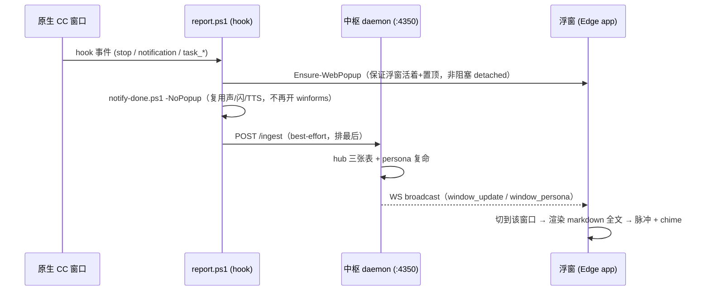

# Web 交接浮窗（Edge app 模式）

> 把「弹窗只能显示一句」升级成「常驻置顶的富文本交接卡」。复用已有 web 资产与中枢数据管道，
> 不重造 WinForms 轮子。承接 `bifrost-hub-v1.md`——数据仍是单向：窗口 → Bifrost → 中枢 → 你。

## 为什么

旧的 WinForms 弹窗（`notify-popup.ps1`）能滚动，却只被喂了首句；且源码被逼成纯 ASCII + base64
塞中文 + 手绘 GDI+ 圆角，渲染天花板低（markdown 只能当纯文本）。而中枢早已把每窗口的 persona 全文
往面板广播——「只显示一句」不是弹窗弱，是没让它去读那份全文。

## 形态

一个**无边框、置顶、常驻**的 Edge「app 模式」窗口，渲染中枢自身端口直供的 `/popup` 页。它是一个
长活、自更新的窗口：任一窗口交接（`stop` 带 persona / `notification` 需你介入）时，浮窗把自己刷成
「最新交接」，脉冲一下 + 亮起一道**未读呼吸辉光**（一直亮到你点「知道了」才熄，收起成标题条时也不熄——
被动置顶的窗口需要一个不会消失的「还没看」信号）。多窗口同时交接时头部亮 `+N` 片，点它轮换到下一个未读，
其余交接不会被最新那条从视野抹掉。平时收起成一条标题栏待命，不打扰。

**声音由 `notify-done`（PS）独占**，浮窗自己不出声：Edge app 用全新 `--user-data-dir`、无任何用户手势，
Chromium autoplay 策略必拦 WebAudio——首次（也最关键的）交接铃声根本响不了，「出声看运气」反成偶发双响的噪音。
一处出声、一处兜底，账才干净。

选 Edge app 模式而非 vendored WebView2：Win11 自带 Edge + WebView2 runtime，零 vendored 二进制、
零版本耦合——正是要逃离的那种构建脆弱性。代价是它是个真 Edge 进程（有任务栏条目），非完全自绘窗口。

## 数据流

关键：浮窗页由 **daemon 自身端口**（4350）直供，页面连**同源** WS——就是 `report.ps1` 早已依赖的
那个端口。一个进程、一个端口、零新依赖。web 面板（独立端口）照旧不受影响。

## 组成

| 件 | 职责 |
|---|---|
| `src/web/public/markdown.js` | 极简 markdown 渲染（先转义再解析，无第三方依赖，行内码哨兵占位防撞车，链接只放行 http/https）。**浮窗与中枢面板共用**，挂 `window.MjMarkdown`。 |
| `src/web/public/popup.{html,js,css}` | 单窗口交接卡：头部（含 `+N` 多窗口片）+ persona 全文（用 `markdown.js` 渲染）+ 本轮活动 mini 流 + 知道了/复制。未读呼吸辉光直到点「知道了」。连同源 WS，逻辑与 `app.js` 同源同构。 |
| `src/web/staticAssets.ts` | 抽出的公共静态资产逻辑（目录解析 + 读文件 + WS 注入），daemon 与 web server 共用。 |
| `src/core/daemon.ts` | `onHttp` 加白名单路由 `/popup* + /markdown.js`（仅这几个路径，防目录穿越），注入 `__AUTO_WS__` 让页面自解析同源 WS。 |
| `bifrost/scripts/popup-web.ps1` | 浮窗启动器。**按窗口标题单例**（msedge 多进程使 PID 不可靠）：已开则只 `SetWindowPos` 置顶后退出；否则 `msedge --app` 拉起右下角 + 轮询置顶（`HWND_TOPMOST + NOACTIVATE`，置顶不抢焦点）。Edge 缺失返回退出码 2。 |
| `bifrost/scripts/report.ps1` | `Invoke-FullNotify` 按 `popup` 配置分流：`web`（默认）→ 保浮窗活 + 声音链；Edge 缺失自动回退 `winforms`；`none` → 仅声音。 |
| `bifrost/report.config.jsonc` | 新增 `popup: web | winforms | none`。 |

## 防御 / 自愈

- **Edge 缺失** → `popup-web.ps1` 返回 2，`report.ps1` 自动回退旧 WinForms 弹窗。
- **非阻塞契约** → 启动器 detached 拉起，其冷启动置顶轮询不卡回合；Edge 存在性用一次廉价路径探测判定，不等启动器。
- **WS 断** → 页面 2s 自动重连（照搬 `app.js`）。
- **声音归属** → 浮窗不出声，`notify-done`（PS，`majordomo-beep.lock` 互斥）独占；杜绝浏览器 chime 空转 + 偶发双响。
- **漏看** → 未读呼吸辉光持续到点「知道了」，多窗口 `+N` 片，两者都不会像脉冲那样闪一下就没。
- **单例** → 按标题去重，重复 hook 不会堆出多个窗口，只重新置顶。
